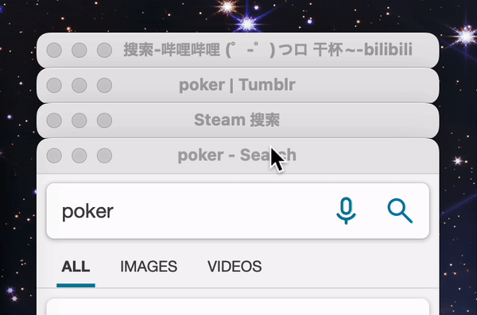

# Poker - Search

一款灵感来源于 Smartisan TNT 发牌手的 Chrome 扩展插件。

它能够让用户**输入一个关键词**后，用全新的交互方式一次性展现出用户所有收录进 Poker 的网站的搜索结果。 
而这个收录的网站，只需要有能进行搜索的 URL 即可。

并且，利用窗口打开的方式能够让用户保持住既有缓存与网站登录状态。 
**也正因如此，这款插件的作用绝不仅仅只是搜索引擎上的站内搜索。**

#### 它还能……

- **在办公上**（邮箱、开发网站、素材网站）
- **在学术上**（**翻译**、论文网站、新闻网站）
- **在旅行上**（景点评测、游记、机票酒店美食、**地图**）
- **在商品比价上**（你能利用的网购平台，**都能以你的所在地价格展示**，并一目了然）
- **在资源搜索上**（BT、PT、网盘搜索、仓库……各种资源网站一目十行）

# 下载安装

安装方式有两种， 一种是去 [Chrome 的 Web Store](https://chrome.google.com/webstore/detail/poker-search/oojeodibjbmkclnocinjolfaigheengg) 上下载；另一种是下载[这个 Release 条目](https://github.com/VecHK/poker-search/releases/latest)下的 zip 文件来安装。

zip 文件文件的安装方式会麻烦一些，你需要进行如下步骤：

1. 先打开 Chrome，在地址栏输入 chrome://extensions 后进入扩展程序管理页面
1. 启用页面右上角的「开发者模式」
1. 然后解压 poker.zip ，将解压出来的文件夹拖拽到这个页面上，即可完成安装

两种安装方式似乎是没有什么区别的，不过因为谷歌审核的原因， Web Store 的更新都会稍慢一些。

# 简易使用

- 安装完 Poker后，可以在网页空白处点击右键，即可看到「启动 Poker」的启动项。除此之外，你还可以用快捷键 `Ctrl+Shift+1`(mac 的是 `⌘ + ⇧ + 1`)，也可以点击地址栏右侧的 Poker 图标启动，甚至在地址栏输入「poker」后再敲击`TAB`键也能启动 Poker。

- 启动 Poker 后，你若是再点击右键菜单栏，或者按下快捷键和点击地址栏右侧的 Poker 图标，这将不会启动第二个 Poker 主窗口，而是唤回现在正在运行着的 Poker 主窗口。

- 启动 Poker 后，你能看到输入框下有一条由若干线段组成的长条。点击这些点会使这块区域留空，留空表示不想在搜索后出现这一楼层。还可以滑动选择这些点，可以很快选到自己想要的楼层。 并且，你甚至可以不动鼠标，直接在输入框中，输入 『/楼层 xxx』即可选中所有叫『楼层』的层来搜索xxx。这些能让你在想搜索特定内容时，更快地选择到最相关的网站。

- 在按下回车键提交搜索后，Poker 将会弹出数个搜索窗出来。你可以点击背景的窗口标题栏来切换：  注意到『↑』『↓』这两个按钮了吗？点击它们可以切换每一列最前排的窗口。你还可以点击这些搜索窗的「最大化」来使它还原成普通浏览器窗口的样子（mac的话是点击「最小化」按钮）关闭任意一个窗口后也将会关闭其他的全部窗口。

- 点击地址栏右侧的 Poker 图标即可发现进入设置页面的入口。如果觉得添加站点麻烦，你可以在想要加入 Poker 的网站中输入『poker』或『Poker』后进行搜索的话，再次点击插件图标，便能看到『添加此站点』字样。点击后，便能直接加入到 Poker 中，可以节约手动设置 URL 所浪费的时间。

除了上述的功能，Poker 还有几个实用功能，你可以在设置页面中查看。

# 有疑问或建议

你能直接在 [Discussions](https://github.com/VecHK/poker-search/discussions)、[Issues](https://github.com/VecHK/poker-search/issues) 页面发帖提出。

也能直接联系 [Vec](http://vec.moe/) 与 [NT³](https://t.me/nt_cubic)

# 致谢

灵感来源于 Smartisan TNT 的发牌手。

本项目最初以 [chrome-extension-boilerplate-react](https://github.com/lxieyang/chrome-extension-boilerplate-react) 为模板创建。

# 贡献者 ✨

感谢这些牛逼的人们 ([emoji key](https://allcontributors.org/docs/en/emoji-key)):

<!-- ALL-CONTRIBUTORS-LIST:START - Do not remove or modify this section -->
<!-- prettier-ignore-start -->
<!-- markdownlint-disable -->
<table>
  <tr>
    <td align="center"><a href="http://vec.moe"> <b>Vec</b></a> <a href="https://github.com/VecHK/poker-search/commits?author=VecHK" title="Code">💻</a> <a href="#ideas-VecHK" title="Ideas, Planning, & Feedback">🤔</a></td>
    <td align="center"><a href="https://github.com/nt-cubic"> <b>NT³</b></a> <a href="#design-nt-cubic" title="Design">🎨</a> <a href="#ideas-nt-cubic" title="Ideas, Planning, & Feedback">🤔</a></td>
    <td align="center"><a href="https://github.com/iwazaki-uta"> <b>iwazaki-uta</b></a> <a href="#ideas-iwazaki-uta" title="Ideas, Planning, & Feedback">🤔</a></td>
    <td align="center"><a href="http://sadnap.github.io"> <b>SadnAp</b></a> <a href="https://github.com/VecHK/poker-search/issues?q=author%3ASadnAp" title="Bug reports">🐛</a></td>
    <td align="center"><a href="https://nebula-soft.com"> <b>Hanawa Hinata</b></a> <a href="https://github.com/VecHK/poker-search/issues?q=author%3Abainesing" title="Bug reports">🐛</a></td>
  </tr>
</table>

<!-- markdownlint-restore -->
<!-- prettier-ignore-end -->

<!-- ALL-CONTRIBUTORS-LIST:END -->

此项目遵循 [all-contributors](https://github.com/all-contributors/all-contributors) 规范。欢迎提交任何形式的贡献！
