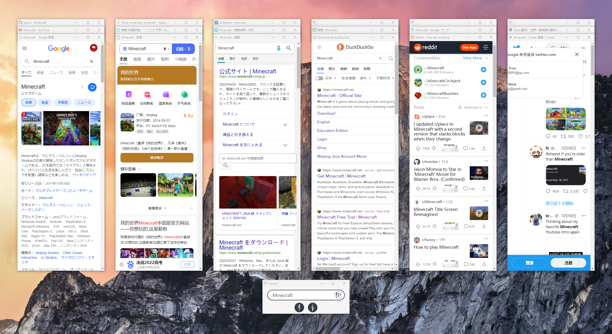

# Poker - Search

一款灵感来源于 Smartisan TNT 发牌手的 Chrome 扩展插件。

它能够让用户**输入一个关键词**后，用全新的交互方式一次性展现出用户所有收录进 Poker 的网站的搜索结果。 
而这个收录的网站，只需要有能进行搜索的 URL 即可。

并且，利用窗口打开的方式能够让用户保持住既有缓存与网站登录状态。 
**也正因如此，这款插件的作用绝不仅仅只是搜索引擎上的站内搜索。**

#### 它还能……

- **在办公上**（邮箱、开发网站、素材网站）
- **在学术上**（**翻译**、论文网站、新闻网站）
- **在旅行上**（景点评测、游记、机票酒店美食、**地图**）
- **在商品比价上**（你能利用的网购平台，**都能以你的所在地价格展示**，并一目了然）
- **在资源搜索上**（BT、PT、网盘搜索、仓库……各种资源网站一目十行）

# 下载安装

安装方式有两种， 一种是去 [Chrome 的 Web Store](https://chrome.google.com/webstore/detail/poker-search/oojeodibjbmkclnocinjolfaigheengg) 上下载；另一种是下载[这个 Release 条目](https://github.com/VecHK/poker-search/releases/latest)下的 zip 文件来安装。

zip 文件文件的安装方式会麻烦一些，你需要进行如下步骤：

1. 先打开 Chrome，在地址栏输入 chrome://extensions 后进入扩展程序管理页面
1. 启用页面右上角的「开发者模式」
1. 然后解压 poker.zip ，将解压出来的文件夹拖拽到这个页面上，即可完成安装

两种安装方式似乎是没有什么区别的，不过因为谷歌审核的原因， Web Store 的更新都会稍慢一些。

# 使用方法

## - Poker 召唤术 -
可以让你以最快速度用上 Poker，搜索你最想要的结果。

### 地址栏召唤
在浏览器的地址栏输入『poker + 空格』后激活 Poker 进行搜索。

### 图标召唤
现可直接点击地址栏旁的插件图标进行搜索。

### 快捷键召唤
在任何时候，可使用 `Ctrl + Shift + 1` 直接启动 Poker。(macOS 为 `⌘ + ⇧ + 1`)

### 右键召唤
在浏览器任意位置右键，可以直接召唤 Poker。 
并且，你还能直接右键搜索选中的内容。

### 试试 Poker！
在各大搜索引擎中，顶部与底部都添加了『试试 Poker』。 
让你能在搜不出想要结果时，一键启动 Poker 搜索。

### 唤回 Poker
Poker 总是会被其他窗口压在下面，怎么办？ 
在 Poker 启动后再执行 图标启动、快捷键启动、右键启动 的话，能立马呼唤回正在运行的 Poker。

## - 我只要第 188 层 -

启用 Poker 后，你能看到输入框下有一条由若干线段组成的长条。 
点击这些点会使这块区域留空，留空表示不想在搜索后出现这一楼层。 
还可以滑动选择这些点，可以很快选到自己想要的楼层。

并且，你甚至可以不动鼠标，直接在输入框中，输入 『/楼层 xxx』 
即可选中所有叫『楼层』的层来搜索xxx。 
除了『/』，你还可以使用 『\』『-』『。』『，』『·』『・』『～』『`』『｀』『、』 这些字符。 
同时空格字符也可以是全角的。

这些能让你在想搜索特定内容时，更快地选择到最相关的网站。

## - 最大化你想看的网站 -

现在，你能利用『新建标签页』直接进入大屏页面外，你还能直接点击相应窗口的『最大化按钮』，让这个窗口进入大屏模式。(如果你是 macOS，则是使用最小化按钮)

## - 如加入收藏夹一样，一键将网站加入 Poker -

现在，在想要加入 Poker 的网站中输入『poker』或『Poker』后进行搜索的话，再次点击插件图标，便能看到『添加此站点』字样。

点击后，便能直接加入到 Poker 中，再也不需要花费巨大精力一个个进行设置了。

## - 单独搜索特定网站 -

在地址栏中输入『poker + 某网站域名的一部分 + 搜索内容』即可直接跳转到那个网站中搜索你想要的内容。

譬如：poker youtube Minecraft 
即可直接跳到 YouTube 中搜索到 Minecraft 的视频。

并且，此功能并没有启动 Poker 主窗口，它只是从站点配置中找到匹配好的域名并跳转过去。 
这意味着你即便不常用 Poker 搜索，也能用这个小功能大幅改善你的浏览器搜索效率。

## - 强制使用移动端 -

此功能，能让那些顽固不化的网站乖乖变为手机版本，让你在 Poker 的窗口中使用得更加舒适。

但需要注意的是，此功能会启动浏览器的调试接口，导致窗口会出现「Poker 正在调试该页面」的字段，进而减慢 Poker 的启动速度。

同时，Windows 10 平台若不是最新版本，会存在不起效的问题，需要注意。

# 有疑问或建议

你能直接在 [Discussions](https://github.com/VecHK/poker-search/discussions)、[Issues](https://github.com/VecHK/poker-search/issues) 页面发帖提出。

也能直接联系 [Vec](http://vec.moe/) 与 [NT³](https://t.me/nt_cubic)

# 致谢

灵感来源于 Smartisan TNT 的发牌手。

本项目最初以 [chrome-extension-boilerplate-react](https://github.com/lxieyang/chrome-extension-boilerplate-react) 为模板创建。

# 贡献者 ✨

感谢这些牛逼的人们 ([emoji key](https://allcontributors.org/docs/en/emoji-key)):

<!-- ALL-CONTRIBUTORS-LIST:START - Do not remove or modify this section -->
<!-- prettier-ignore-start -->
<!-- markdownlint-disable -->
<table>
  <tr>
    <td align="center"><a href="http://vec.moe"> <b>Vec</b></a> <a href="https://github.com/VecHK/poker-search/commits?author=VecHK" title="Code">💻</a> <a href="#ideas-VecHK" title="Ideas, Planning, & Feedback">🤔</a></td>
    <td align="center"><a href="https://github.com/nt-cubic"> <b>NT³</b></a> <a href="#design-nt-cubic" title="Design">🎨</a> <a href="#ideas-nt-cubic" title="Ideas, Planning, & Feedback">🤔</a></td>
    <td align="center"><a href="https://github.com/iwazaki-uta"> <b>iwazaki-uta</b></a> <a href="#ideas-iwazaki-uta" title="Ideas, Planning, & Feedback">🤔</a></td>
  </tr>
</table>

<!-- markdownlint-restore -->
<!-- prettier-ignore-end -->

<!-- ALL-CONTRIBUTORS-LIST:END -->

此项目遵循 [all-contributors](https://github.com/all-contributors/all-contributors) 规范。欢迎提交任何形式的贡献！
