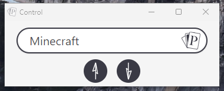
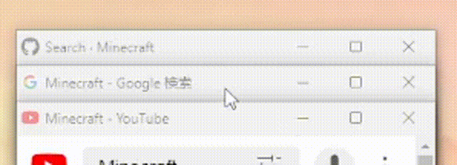

# Poker - Search

一款灵感来源于 Smartisan TNT 发牌手的 Chrome 扩展插件。

它能够让用户**输入一个关键词**后，用全新的交互方式一次性展现出用户所有收录进 Poker 的网站的搜索结果。 
而这个收录的网站，只需要有能进行搜索的 URL 即可。

并且，利用窗口打开的方式能够让用户保持住既有缓存与网站登录状态。 
**也正因如此，这款插件的作用绝不仅仅只是搜索引擎上的站内搜索。**

#### 它还能……

- **在办公上**（邮箱、开发网站、素材网站）
- **在学术上**（**翻译**、论文网站、新闻网站）
- **在旅行上**（景点评测、游记、机票酒店美食、**地图**）
- **在商品比价上**（你能利用的网购平台，**都能以你的所在地价格展示**，并一目了然）
- **在资源搜索上**（BT、PT、网盘搜索、仓库……各种资源网站一目十行）

# 下载安装

安装方式有两种， 一种是去 [Chrome 的 Web Store](https://chrome.google.com/webstore/detail/poker-search/oojeodibjbmkclnocinjolfaigheengg) 上下载；另一种是下载[这个 Release 条目](https://github.com/VecHK/poker-search/releases/latest)下的 zip 文件来安装。
 
zip 文件文件的安装方式会麻烦一些，你需要进行如下步骤：

1. 先打开 Chrome，在地址栏输入 chrome://extensions 后进入扩展程序管理页面
1. 启用页面右上角的「开发者模式」
1. 然后解压 poker.zip ，将解压出来的文件夹拖拽到这个页面上，即可完成安装
 
两种安装方式似乎是没有什么区别的，不过因为谷歌审核的原因， Web Store 的更新都会稍慢一些。
 
# 使用方法

## 启动前的设置

我们花费了大量的时间去制作『扩展选项』的设置页面。
**<u>因此我们推荐使用前，先去看看设置页面的初期配置。</u>**

你能够在设置中看到我们最先配置给你的网站，以便上手就能正常使用。 
各位能进行删除与 **点击『+』** 号按钮进行页面的添加，甚至能设置这个页面是否以手机模式进行加载（某些网站并不支持，因此会导致搜索结果出现一串乱码。此时请关闭此网站的手机加载模式）

当你准备添加新网站时，需要在 URL 中把想要搜索的关键字替换为 **%poker%**，例如：
- 
https://www.google.com/search?q=<b>%poker%</b>

- 
https://www.youtube.com/results?search_query=<b>%poker%</b>

- 
https://github.com/search?q=<b>%poker%</b>

但由于此添加方案过于繁琐，且不适于像我们的老父母那样的用户进行使用，因此我们也有了相对的解决方案。
敬请期待下一版的更新。

## 启用

用户需要在地址栏（搜索栏）中输入<b><u>『poker』+『空格』+『想要搜索的内容』</u></b>才能启动 Poker 进行搜索。

由于这种开启方式非常繁琐，目前我们已经有两个解决方案：

1. 新建标签页与启动页可设置为 Poker
2. 全局快捷键启动 Poker 的控制台

敬请期待下一版的更新。

## 使用

Poker 搜索启动后，用户能在底部的控制台窗口中再次键入新内容进行再一次的搜索。
也可以在控制台窗口点击『↑』『↓』按钮切换显示的层级。

而若是你想单独看后面层级的某个网站时，你能点击那个网站的窗口顶部将它移动到最前面。

# 有疑问或建议

你能直接在 [Discussions](https://github.com/VecHK/poker-search/discussions)、[Issues](https://github.com/VecHK/poker-search/issues) 页面发帖提出。

也能直接联系 [Vec](http://vec.moe/) 与 [NT³](https://t.me/nt_cubic)

# 致谢

灵感来源于 Smartisan TNT 的发牌手。

本项目最初以 [chrome-extension-boilerplate-react](https://github.com/lxieyang/chrome-extension-boilerplate-react) 为模板创建。

# 贡献者 ✨

感谢这些牛逼的人们 ([emoji key](https://allcontributors.org/docs/en/emoji-key)):

<!-- ALL-CONTRIBUTORS-LIST:START - Do not remove or modify this section -->
<!-- prettier-ignore-start -->
<!-- markdownlint-disable -->
<table>
  <tr>
    <td align="center"><a href="http://vec.moe"> <b>Vec</b></a> <a href="https://github.com/VecHK/poker-search/commits?author=VecHK" title="Code">💻</a> <a href="#ideas-VecHK" title="Ideas, Planning, & Feedback">🤔</a></td>
    <td align="center"><a href="https://github.com/nt-cubic"> <b>NT³</b></a> <a href="#design-nt-cubic" title="Design">🎨</a> <a href="#ideas-nt-cubic" title="Ideas, Planning, & Feedback">🤔</a></td>
  </tr>
</table>

<!-- markdownlint-restore -->
<!-- prettier-ignore-end -->

<!-- ALL-CONTRIBUTORS-LIST:END -->

此项目遵循 [all-contributors](https://github.com/all-contributors/all-contributors) 规范。欢迎提交任何形式的贡献！
